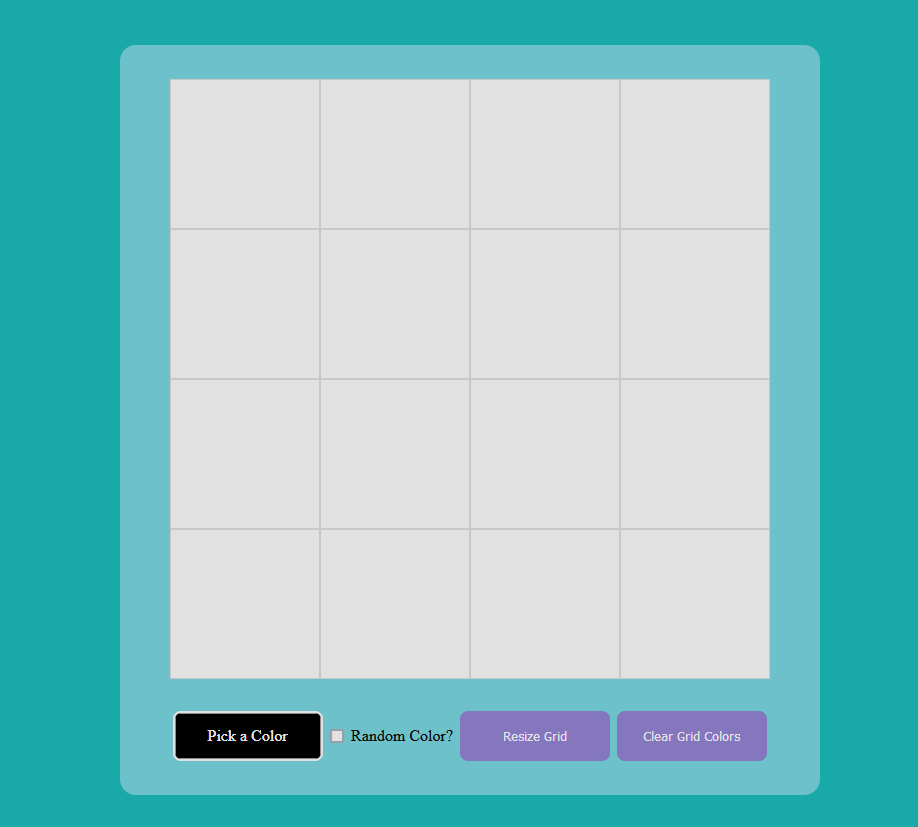
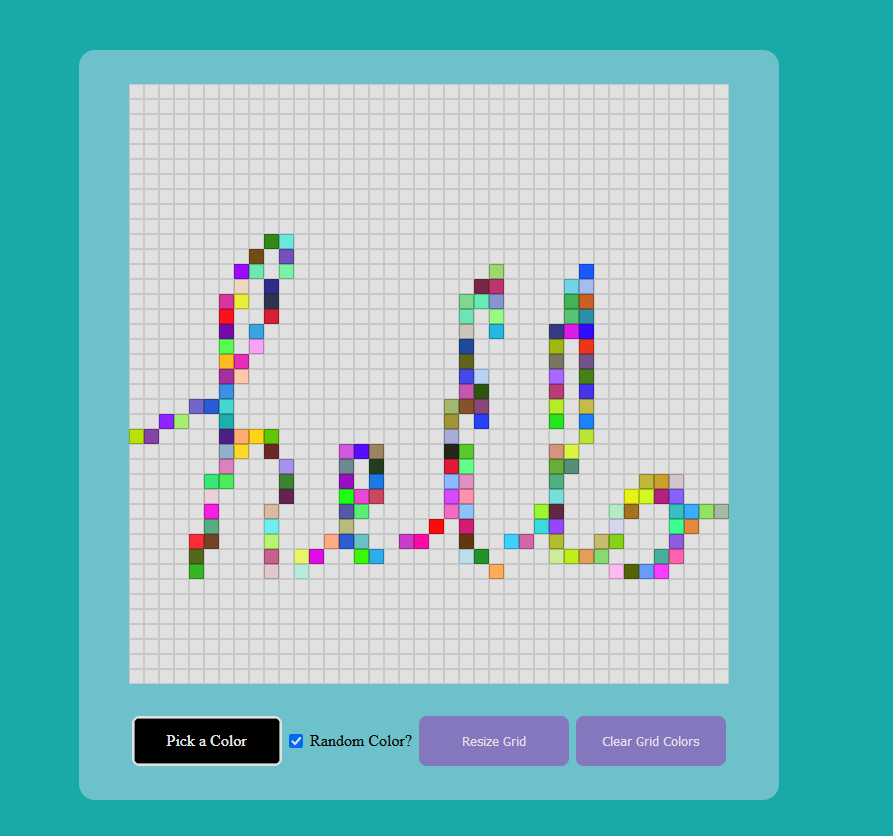

# The Odin Project - "Etch-a-Sketch" Solution

This is a solution to [The Odin Project's "Etch-a-Sketch" Project](https://www.theodinproject.com/lessons/foundations-etch-a-sketch).

Users can mouseover the squares to create pixel art, similar to the popular toy.

This solution features a randomize color option.

With random colors:

